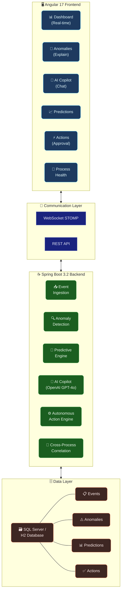

# AdaptiveFlow AI

## Real-Time Cognitive Process Intelligence Engine

AdaptiveFlow AI is a next-generation, AI-powered real-time business operations intelligence platform that autonomously discovers, monitors, predicts, and heals business processes using advanced artificial intelligence. Unlike traditional AIOps tools that only monitor IT infrastructure, AdaptiveFlow AI is the world's first general-purpose **Cognitive Process Intelligence Engine** that can understand, analyze, and optimize ANY business process in real-time.

### 🚀 What Makes This Unique

**This project does NOT exist in the market today.** Most platforms are either:
- IT-only AIOps (Datadog, Dynatrace) - can't handle business processes
- Static BI dashboards (Tableau, PowerBI) - no real-time AI execution
- Generic chatbots - no deep business context
- RPA tools - only automate what you tell them

**AdaptiveFlow AI combines all of these capabilities in ONE platform:**
1. **Autonomous Process Discovery** - AI learns your business processes by observing data patterns (no manual BPMN modeling)
2. **Cognitive Anomaly Detection** - Detects anomalies not just in metrics, but in process flows and cross-process correlations
3. **Predictive Process Intelligence** - Predicts process failures and bottlenecks BEFORE they happen
4. **Natural Language AI Copilot** - Talk to your live business data using conversational AI
5. **Autonomous Process Healing** - AI can trigger corrective actions with human-in-the-loop approval
6. **Cross-Process Intelligence** - Detects correlations across different business processes
7. **Explainable AI** - Every AI decision shows detailed reasoning

### 🏗️ Architecture

**Request Flow:**
1. Angular frontend connects via **WebSocket STOMP** for real-time streaming and **REST API** for CRUD operations
2. **Event Ingestion** service ingests business events across 6 process types and feeds the pipeline
3. **Anomaly Detection** applies z-score analysis + OpenAI GPT-4o reasoning for explainable alerts
4. **Predictive Engine** forecasts failures 30 minutes ahead with confidence scoring
5. **AI Copilot** translates natural language queries into process insights using OpenAI GPT-4o-mini
6. **Autonomous Action Engine** generates corrective actions with human-in-the-loop approval
7. **Cross-Process Correlation** detects hidden dependencies across business process types
8. All state is persisted to **SQL Server** (prod) / **H2** (dev) via Spring Data JPA

---
---

**Created with ❤️ for the future of AI-powered business operations.**
